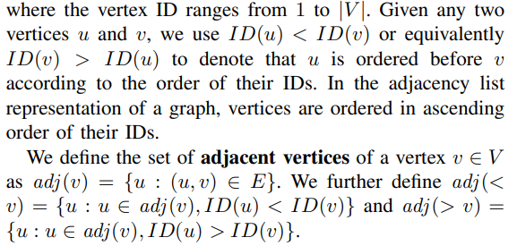

# Maximal Clique Enumerator

I implemented the distributed algorithm described in http://www.cs.cuhk.hk/~adafu/Pub/distMaxClique_bigdata14.pdf for finding the maximal cliques in an undirected graph. ([What are these?](#Explanation))

I wanted to explore the difficulty of unwrapping the complex ideas in a scientific paper and implementing the algorithms for a practical use. I showed that it is possible to digest the key facts that allow one to use the scientific results in a matter of hours - while having no idea what I was reading. One needs to take the right scheduling approach in order to complete the task as fast as possible.

I chose Python due to my familiarity with it and the expressiveness of the resulting implementation.

Python managed to match in some degree the mathematical notation in the paper in a neat way. For example:

-  became functions, so that I could run `adj(v)` to get the defined set of adjacent vertices
-  became a generator shorthand expression that outputs tuples `(v, adj(v)) for v in V`
- Set operations were really simple: `set1 - set2` is the `set1` without the elements that belong in `set2`

I used the [SNAP package](http://snap.stanford.edu/snappy/index.html) by Stanford University that allows for easy scalability in graph problems. Note that the backend is written in C++ so the Python overhead would be hopefully small.

# How to use

- Install snap.py `pip3 install snap-stanford`
- Run the script `python3 max_clique.py`

# Explanation

This is a graph:

This is a clique (a set of vertices where everything is connected to everything):

These are the maximal cliques (cliques that cannot be expanded more):

The problem asks to find the maximal cliques in an undirected graph. The interest seems to be mainly scientific, but there could be useful real-world applications as well.